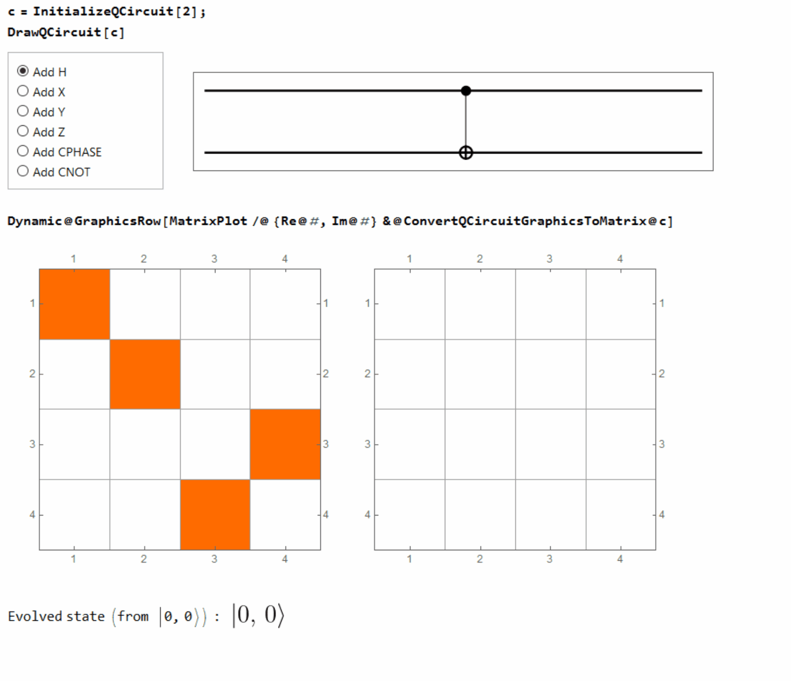

# QM
Mathematica package for quantum mechanics calculations.

## Installation
Evaluate the following to automatically install `QM` on your system (code adapted from the [MaTeX readme page](https://github.com/szhorvat/MaTeX)):

```Mathematica
Module[{json, download, target},
  Check[
    json = Import["https://api.github.com/repos/lucainnocenti/QM/releases/latest", "JSON"];
    download = Lookup[First@Lookup[json, "assets"], "browser_download_url"];
    target = FileNameJoin[{CreateDirectory[], "QM.paclet"}];
    If[$Notebooks,
      PrintTemporary @ Labeled[ProgressIndicator[Appearance -> "Necklace"], "Downloading...", Right],
      Print["Downloading..."]
    ];
    URLSave[download, target],
    Return[$Failed]
  ];
  If[FileExistsQ[target], PacletInstall[target], $Failed]
]
```
If you later want to uninstall `QM`, just run `PacletUninstall["QM"]`.
Note that the above code only installs the last release of the package, which may not contain the latest updates.
Just clone this repo in the folder given by Mathematica with `FileNameJoin@{$UserBaseDirectory, "Applications"}` for the latest version of the code.

Alternatively, the core functionality can be used without installing the package, importing the main file directly from GitHub evaluating:
```
Get["https://raw.githubusercontent.com/lucainnocenti/QM/master/QM.m"]
```

## Demo



